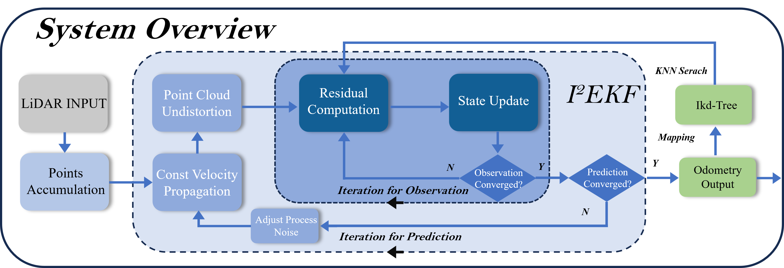
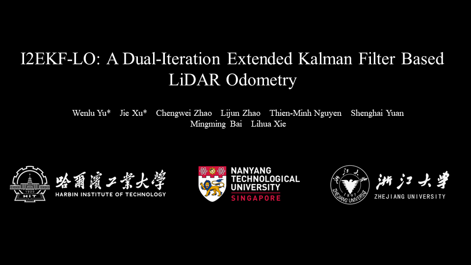

<div align="center">
    <h1>I2EKF-LO</h1>
    <i>A Dual-Iteration Extended Kalman Filter Based  LiDAR Odometry</i>
    <br>
    <strong>IROS 2024 Oral</strong>
    <br>
    
<br>
</div>

### Introduction
LiDAR odometry is a pivotal technology in the fields of autonomous driving and autonomous mobile robotics. However, most of the current works focuse on nonlinear optimization methods, and there are still many challenges in using the traditional Iterative Extended Kalman Filter (IEKF) framework to tackle the problem: IEKF only iterates over the observation equation, relying on a rough estimate of the initial state, which is insufficient to fully eliminate motion distortion in the input point cloud; the system process noise is difficult to be determined during state estimation of the complex motions; and the varying motion models across different sensor carriers. To address these issues, we propose the Dual-Iteration Extended Kalman Filter (I2EKF) and the LiDAR odometry based on I2EKF (I2EKF-LO). This approach not only iterates over the observation equation but also leverages state updates to iteratively mitigate motion distortion in LiDAR point clouds. Moreover, it dynamically adjusts process noise based on the confidence level of prior predictions during state estimation and establishes motion models for different sensor carriers to achieve accurate and efficient state estimation. Comprehensive experiments demonstrate that I2EKF-LO achieves outstanding levels of accuracy and computational efficiency in the realm of LiDAR odometry.

**Developers**: The codes of this repo are contributed by [Wenlu Yu (于文录)](https://github.com/YWL0720), [Jie Xu (徐杰)](https://github.com/jiejie567), [Chengwei Zhao (赵成伟)](https://github.com/chengwei0427)

### News
* **[30/06/2024]**: I2EKF-LO is accepted to IROS 2024.
* **[01/07/2024]**: We are currently working on organizing and refining the complete code. The full version will be released soon.
* **[02/07/2024]**: Updated the video link and submitted the paper to arxiv.

### Related Paper

Related paper available on arxiv: [I2EKF-LO: A Dual-Iteration Extended Kalman Filter Based LiDAR Odometry](https://arxiv.org/abs/2407.02190) 

### Related Video:

<div align="center">
    <a href="https://youtu.be/jaNavKRnpiE" target="_blank"/>
    
</div>

## 1. Prerequisites

### 1.1 **Ubuntu** and **ROS**

Ubuntu >= 18.04.

ROS    >= Melodic. [ROS Installation](http://wiki.ros.org/ROS/Installation)

### 1.2. **PCL && Eigen**

PCL    >= 1.8,   Follow [PCL Installation](http://www.pointclouds.org/downloads/linux.html).

Eigen  >= 3.3.4, Follow [Eigen Installation](http://eigen.tuxfamily.org/index.php?title=Main_Page).

### 1.3. **livox_ros_driver**

Follow [livox_ros_driver Installation](https://github.com/Livox-SDK/livox_ros_driver).


## 2. Build

Clone the repository and catkin_make:

```
cd ~/catkin_ws/src
git clone https://github.com/YWL0720/I2EKF-LO
cd ..
catkin_make -j
source devel/setup.bash
```

## 3. Directly run

```bash
cd ~/$I2EKF_LO_ROS_DIR$
source devel/setup.bash
roslaunch i2ekf_lo xxx.launch
```
## 4. Rosbag Example
Download our test bags here: [HIT-TIB Datasets](https://drive.google.com/drive/folders/1L5cX9uyAiZei17oq7ELyd8WyIRReHq8u?usp=drive_link).

## 5. Acknowledgments

Thanks for [Fast-LIO2](https://github.com/hku-mars/FAST_LIO) (Fast Direct LiDAR-inertial Odometry) and [LI-INIT](https://github.com/hku-mars/LiDAR_IMU_Init)(Robust Real-time LiDAR-inertial Initialization).

## 6. License

The source code is released under [GPLv2](http://www.gnu.org/licenses/) license.

## 7. TODO(s)
- [ ] Updated video link
- [ ] Upload a preprint of our paper
